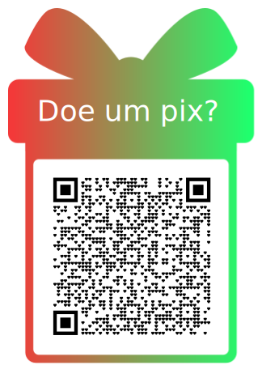

Simulador da prova Anpec com verificação automática da sua nota.

# Sobre o Projeto 
Este projeto é aberto para beneficiar a todas as pessoas que gostariam de acessar um simulador da prova da Associação Nacional dos Centros de Pós-Graduação em Economia (ANPEC). Este é um projeto com recursos muito limitados, mas que contém altruísmo para contribuir para o processo de formação das pessoas. Nisso, temos algumas orientações básicas para te instruir sobre o que não for intuitivo. 

Em caso de dúvidas, pode entrar em contato com o e-mail: contato@falnes.io 

Boa sorte na sua caminhada!

# Como instalar Obsidian

O Obsidian pode ser instalado gratuitamente através do seguinte link:
https://obsidian.md/download

# Como baixar esse projeto

Pode baixar esse projeto clicando nesse link e depois extraindo o arquivo:
https://github.com/Falnesio/Simulador-Anpec/archive/refs/heads/main.zip

Pode também baixar usando o git se souber como.

# Como abrir esse projeto no Obsidian

Após tiver o arquivo extraído, pode abrir o Obsidian e escolher abrir uma pasta como um cofre. Selecionará a pasta desse projeto. Irá pedir para aceitar os plugins que estão associados ao projeto, terá que aceitar para que o projeto funcione corretamente.

# Onde ir após abrir o projeto
## [Inicie Aqui!!!](Inicie%20Aqui!!!.md)

# Licença 

<a property="dct:title" rel="cc:attributionURL" href="https://github.com/Falnesio/Simulador-Anpec">Simulado Obsidian da Anpec</a> by <a rel="cc:attributionURL dct:creator" property="cc:attributionName" href="https://falnes.io/">Falnésio GS Borges</a> is licensed under <a href="https://creativecommons.org/licenses/by/4.0/?ref=chooser-v1" target="_blank" rel="license noopener noreferrer" style="display:inline-block;">CC BY 4.0</a>

**Muito obrigado à minha querida parceira Moreira Morais por todas as contribuições de edição e incentivo!!!❤️❤️❤️** 

# Apoie 

Se **curtiu** e quer **incentivar melhorias** nesse projeto mande um pix para pix@falnes.io

# FAQ

1. Tem todas as provas da ANPEC?
	a. Atualmente tem as provas de 2024 e 2025. 
2. Tenho que saber programar para usar?
	a. Não. Todavia conhecer o funcionamento do Obsidian ajuda.
3. Tenho que pagar para usar?
	a. Não. A licença é gratuita, podendo usar como quiser desde que dado atribuição. 
4. Da pra usar no celular?
	a. Se o Obsidian e os plugins atribuídos abrirem no seu celular, então sim. 
5. Caso dê problema, eu posso tirar dúvidas?
	a. Pode tirar dúvidas pelo me e-mail contato@falnes.io ou pelos issues do github se souber como usar. 
6. Não achei meu cartão resposta, onde encontrar?
	a. Pode encontrar na página  [Inicie Aqui!!!](Inicie%20Aqui!!!.md).
7. Qual a diferença de gabarito pra cartão resposta?
	a. O cartão resposta é onde você preenche suas respostas ao fazer o simulado.
	Já o gabarito são as respostas certas da Anpec. 
8. O que fazer quando der erro? (Tipos de erro)
	a. Se der erro pode entrar em contato comigo. Existem vários locais online (a maioria em inglês) para ajudar a resolver problemas envolvendo o Obsidian ou seus plugins.
9. Eu posso gerar vários cartões resposta?
	a. Pode gerar vários cartões resposta.
10. Os cartões resposta ficam gravados?
	a. Assim que escrever sua resposta, ela fica gravada.
11. Quanta privacidade tenho?
	a. Ao baixar o projeto tudo fica guardado localmente.
12. Onde está a prova?
	a. As provas de 2024 e 2024 estão no formato pdf na pasta provas. 

# Imagem da página de [Resultados](Resultados.md)

